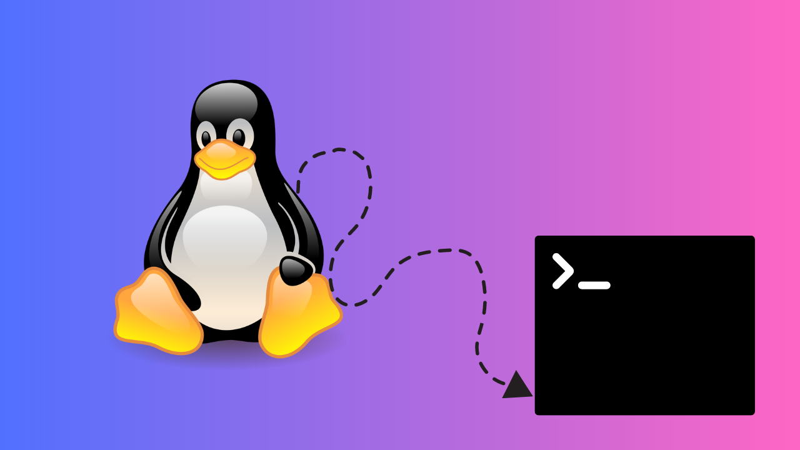

# 🐚 NeXShell

**A Custom Shell Implementation with Natural Language Processing and Advanced I/O Features**




## 📋 Project Overview

NeXShell is a custom shell implementation developed as a final year project that demonstrates advanced system programming concepts including process management, inter-process communication, file I/O operations, and natural language processing integration. The project showcases the implementation of core operating system concepts in a practical, user-friendly shell environment.

## 🎯 Project Objectives

- **Demonstrate System Programming Skills**: Implementation of process creation, management, and synchronization
- **Explore Inter-Process Communication**: Pipe handling and process coordination
- **File I/O Operations**: Comprehensive redirection and file handling mechanisms
- **User Experience Enhancement**: Natural language interface for improved usability
- **Performance Monitoring**: Real-time command execution analysis
- **Memory Management**: Efficient buffer management and overflow protection

## ✨ Features Implemented

- ✅ **Basic command execution** (e.g., `ls`, `pwd`, `echo`, etc.)
- 📁 **Directory navigation** with `cd` command
- ⏱️ **Command execution time display** for performance monitoring
- 🔁 **Input/output redirection** (`>`, `<`, `>>`, `2>`)
- | **Pipe handling** for command chaining (`|`)
- 👻 **Background process support** with `&` operator
- 🧠 **Auto-suggestion** for unknown commands
- 🧽 **Built-in commands** (`clear`, `history`, `exit`)
- 💬 **Natural language interface** (e.g., `show files` → `ls`)
- 📜 **Command history** with up to 100 entries

## 🛠️ Technical Implementation

### System Calls Used
- `fork()` - Process creation
- `execvp()` - Program execution
- `wait()` - Process synchronization
- `pipe()` - Inter-process communication
- `dup2()` - File descriptor manipulation
- `open()`, `close()` - File operations
- `chdir()` - Directory navigation
- `gettimeofday()` - Performance measurement

### Core Algorithms

#### Command Parsing Algorithm
```
1. Read user input
2. Sanitize and tokenize input
3. Check for natural language mapping
4. Parse special operators (|, >, <, &)
5. Validate command against whitelist
6. Execute or provide suggestions
```

#### Process Management
```
1. Fork child process
2. Set up I/O redirection if needed
3. Execute command in child
4. Parent waits (foreground) or continues (background)
5. Record execution time and status
```

## 📊 System Architecture

### Core Components

1. **Input Parser**
   - Tokenization using `strtok()`
   - Special character detection
   - Natural language mapping

2. **Process Manager**
   - Fork-based execution model
   - Background process handling
   - Process synchronization

3. **I/O Manager**
   - File descriptor redirection
   - Pipe creation and management
   - Error stream handling

4. **History System**
   - Fixed-size circular buffer
   - Command storage and retrieval
   - Overflow protection

5. **Validation Engine**
   - Command whitelist checking
   - Intelligent suggestion system
   - Error handling

## 💡 Usage Examples

### Basic Operations
```bash
NeXShell> ls 
NeXShell> pwd
NeXShell> cd /home/user/documents
```

### Natural Language Processing
```bash
NeXShell> show files          # Translates to: ls
NeXShell> current directory   # Translates to: pwd
NeXShell> who am i           # Translates to: whoami
```

### Advanced I/O Operations
```bash
# Output redirection
NeXShell> echo Hello World > output.txt

# Pipe operations
NeXShell> ls | sort

# Background execution
NeXShell> sleep 10 &
```

## 📈 Performance Analysis

The shell includes built-in performance monitoring that measures:
- Command execution time (microsecond precision)
- Process creation overhead
- I/O operation latency

Example output:
```
NeXShell> ls
file1.txt  file2.c  directory/
Command executed in 0.002341 seconds
```

## 🔬 Testing and Validation

### Test Cases Implemented
1. **Basic Command Execution**: Standard Unix commands
2. **I/O Redirection**: All redirection operators
3. **Pipe Operations**: Single pipe command chaining
4. **Background Processes**: Process management verification
5. **Natural Language**: Phrase mapping accuracy
6. **Error Handling**: Invalid command responses
7. **Memory Management**: Buffer overflow protection

### Performance Benchmarks
- Average command execution overhead: < 1ms
- Memory usage: Fixed 10KB for history buffer
- Maximum concurrent background processes: Limited by system

## 🚫 Known Limitations

- **Input Length**: Maximum 100 characters per command
- **History Size**: Limited to 100 recent commands
- **Pipe Complexity**: Single pipe support only
- **Platform Dependency**: POSIX-compliant systems only
- **Command Arguments**: Maximum 10 arguments per command

## 🔧 Compilation and Execution

### Prerequisites
- GCC compiler (version 4.8 or higher)
- Linux/Unix operating system
- POSIX-compliant environment

### Build Instructions
```bash
# Compile 
gcc NeXShell.c -o NeXShell

# Run the shell
./NeXShell
```

## 📚 Learning Outcomes

This project demonstrates understanding of:

1. **Operating System Concepts**
   - Process management and lifecycle
   - Inter-process communication mechanisms
   - File system operations and I/O redirection

2. **System Programming**
   - System call usage
   - Memory management in C
   - Signal handling and process control

3. **Software Engineering**
   - Modular code design
   - Error handling and validation
   - Performance optimization techniques

4. **User Interface Design**
   - Natural language processing integration
   - Command suggestion algorithms
   - User experience considerations


## 👨‍💻 Author
- Daksh Goyal
- [GitHub](https://github.com/Daksh700)

